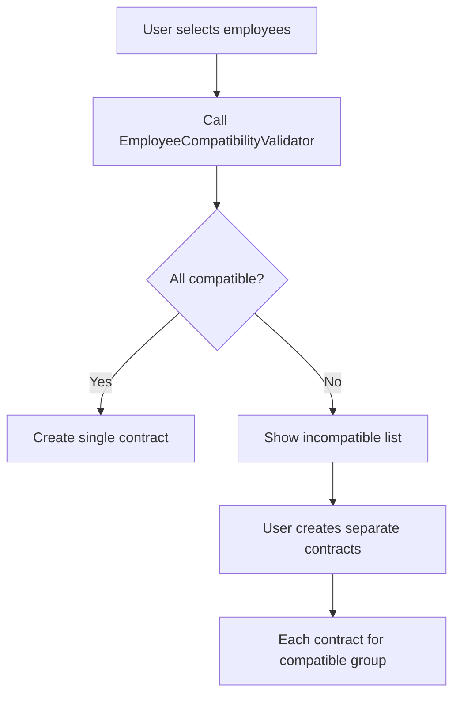

# Employee Compatibility Service - Usage Guide

## Overview

The `EmployeeCompatibilityValidator` service validates that multiple employees can work under the same individual contract (個別契約書). It ensures all employees have compatible working conditions.

## Quick Start

```python
from sqlalchemy.orm import Session
from app.services import EmployeeCompatibilityValidator
from datetime import time, date
from decimal import Decimal

# Initialize with database session
validator = EmployeeCompatibilityValidator(db)

# Validate employees for a contract
result = validator.validate_employees(
    employee_ids=[1, 2, 3, 4],
    factory_line_id=5,
    hourly_rate=Decimal("1400.00"),
    work_start_time=time(8, 0),
    work_end_time=time(17, 0),
    work_days=["Monday", "Tuesday", "Wednesday", "Thursday", "Friday"],
    break_time_minutes=60,
    dispatch_start_date=date(2025, 1, 1),
    dispatch_end_date=date(2025, 12, 31),
)

# Check validation result
if result["is_valid"]:
    print(f"✅ All {result['compatible_count']} employees can be in ONE contract")
else:
    print(f"⚠️ Found {result['incompatible_count']} incompatible employee(s)")
    for suggestion in result["suggestions"]:
        print(f"  - {suggestion}")
```

## Response Structure

```python
{
    "is_valid": bool,                    # True if all employees are compatible
    "compatible_count": int,              # Number of compatible employees
    "incompatible_count": int,            # Number of incompatible employees
    "compatible": [                       # List of compatible employees
        {
            "id": 1,
            "employee_number": "EMP001",
            "full_name_kanji": "山田太郎",
            "line_name": "Manual Assembly",
            "status": "compatible"
        }
    ],
    "incompatible": [                     # List of incompatible employees
        {
            "id": 3,
            "employee_number": "EMP003",
            "full_name_kanji": "神田太郎",
            "line_name": "Welding",
            "issues": [
                {
                    "type": "different_line",
                    "reason": "Employee is on 'Welding' line, but contract expects line ID 5",
                    "severity": "error"
                }
            ]
        }
    ],
    "suggestions": [
        "📍 1 empleado(s) en línea diferente - Crear contrato(s) separado(s) por línea",
        "✅ Crear contrato SEPARADO para 神田太郎"
    ],
    "summary": "⚠️ 3 compatible(s) + 1 incompatible(s) de 4 total → Necesita(n) contrato(s) separado(s)"
}
```

## Validation Rules

### 1. Employee Status
- **Rule**: Employee must have `status = "active"`
- **Severity**: ERROR
- **Example**: Resigned employees cannot be in new contracts

### 2. Factory Line Compatibility
- **Rule**: All employees must be on the same `factory_line_id`
- **Severity**: ERROR
- **Example**: Cannot mix employees from "Assembly Line A" and "Welding Line B"

### 3. Hourly Rate
- **Rule**: Contract's `hourly_rate` should match employee's current rate
- **Severity**: WARNING (rate changes are allowed)
- **Example**: Employee has ¥1300/hr but contract offers ¥1400/hr

### 4. Contract Period
- **Rule**: Employee's `termination_date` must not be before contract start
- **Severity**: ERROR
- **Example**: Employee terminating 2024-12-31 cannot start contract on 2025-01-01

## Issue Types

| Issue Type | Description | Severity |
|------------|-------------|----------|
| `inactive_employee` | Employee is not active | ERROR |
| `different_line` | Employee on different production line | ERROR |
| `different_rate` | Employee's rate differs from contract | WARNING |
| `incompatible_schedule` | Employee terminated before contract starts | ERROR |

## Use Cases

### Use Case 1: API Endpoint Validation

```python
from fastapi import APIRouter, Depends, HTTPException
from app.services import EmployeeCompatibilityValidator
from app.core.database import get_db

router = APIRouter()

@router.post("/kobetsu/validate-employees")
def validate_contract_employees(
    employee_ids: List[int],
    factory_line_id: int,
    hourly_rate: Decimal,
    db: Session = Depends(get_db)
):
    validator = EmployeeCompatibilityValidator(db)

    result = validator.validate_employees(
        employee_ids=employee_ids,
        factory_line_id=factory_line_id,
        hourly_rate=hourly_rate
    )

    if not result["is_valid"]:
        raise HTTPException(
            status_code=400,
            detail={
                "message": "Employees are not compatible",
                "incompatible": result["incompatible"],
                "suggestions": result["suggestions"]
            }
        )

    return result
```

### Use Case 2: Group Employees by Line

```python
# Get employees grouped by production line
grouped = validator.validate_by_line(employee_ids=[1, 2, 3, 4, 5, 6])

# Result: {5: [1, 2, 3], 6: [4, 5], 0: [6]}
# Line 5: Employees 1, 2, 3
# Line 6: Employees 4, 5
# No line: Employee 6

# Create separate contracts for each line
for line_id, emp_ids in grouped.items():
    if line_id == 0:
        print(f"⚠️ {len(emp_ids)} employee(s) have no line assigned")
    else:
        print(f"✅ Create contract for line {line_id} with {len(emp_ids)} employees")
```

### Use Case 3: Pre-validation Before Contract Creation

```python
from app.services import KobetsuService, EmployeeCompatibilityValidator

def create_kobetsu_with_validation(
    employee_ids: List[int],
    factory_line_id: int,
    hourly_rate: Decimal,
    # ... other contract fields
    db: Session
):
    # Step 1: Validate employees are compatible
    validator = EmployeeCompatibilityValidator(db)
    validation = validator.validate_employees(
        employee_ids=employee_ids,
        factory_line_id=factory_line_id,
        hourly_rate=hourly_rate
    )

    if not validation["is_valid"]:
        return {
            "success": False,
            "error": "Employee compatibility check failed",
            "validation": validation
        }

    # Step 2: Create contract with compatible employees
    kobetsu_service = KobetsuService(db)
    contract = kobetsu_service.create(
        data=contract_data,
        created_by=user_id
    )

    return {
        "success": True,
        "contract": contract,
        "validation": validation
    }
```

## Advanced Features

### Auto-detect Expected Line

If `factory_line_id` is not provided, the validator automatically detects the most common line among selected employees:

```python
# Don't specify factory_line_id
result = validator.validate_employees(
    employee_ids=[1, 2, 3, 4],  # 3 on line 5, 1 on line 6
    hourly_rate=Decimal("1400.00")
)
# Validator will use line 5 as expected (majority)
# Employee on line 6 will be flagged as incompatible
```

### Minimal Validation

You can run minimal validation with just employee IDs:

```python
result = validator.validate_employees(employee_ids=[1, 2, 3])
# Only checks:
# - All employees exist
# - All employees are active
# - Auto-detects if on same line
```

## Integration with Contract Creation Flow



## Error Handling

```python
from sqlalchemy.orm import Session

try:
    result = validator.validate_employees(
        employee_ids=[999, 1000],  # Non-existent IDs
        factory_line_id=5
    )
except ValueError as e:
    # Handle missing employees
    print(f"Error: {e}")
    # "Employees not found: {999, 1000}"
```

## Performance Notes

- **Single Query**: Fetches all employees in one database query
- **Efficient**: O(n) validation for n employees
- **Recommended**: Validate up to 100 employees at once
- **Large Batches**: For 1000+ employees, consider chunking

## Testing

See `/backend/tests/test_employee_compatibility_service.py` for comprehensive test examples.
